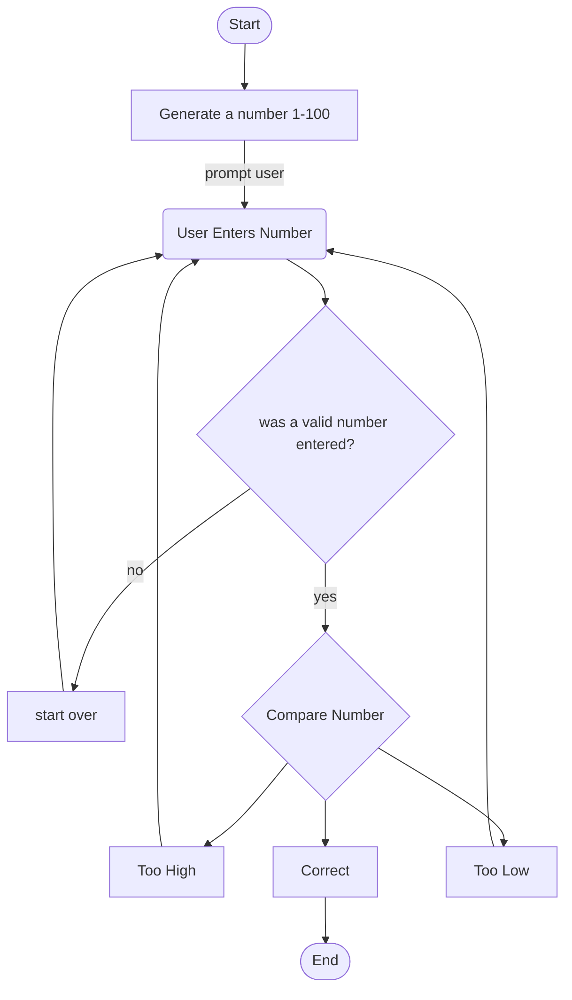

#### Mermaid flowchart guessing game 

###### Summary 
when the program starts the computer will generate a number between 1 and 100. After this it will prompt the user to enter their choice in number. Once the person picks a number the computer makes sure it is a valid number that is between 1 and 100 and makes sure it is a number and not some other character. If it proves to be an invalid option, then it will start over and have the person pick a new number.  If it proves to be a valid number then it will compare the number to three options one if the number is lower than the selected number of the computer, two if the number is higher than the selected number and three if the number is correct. Let’s say the number is higher or lower if so, will both result in taking you back to picking a new number with having a better guess to what the number is. But if the number ends up being the correct number, then the program will end with you getting it correct 

    
